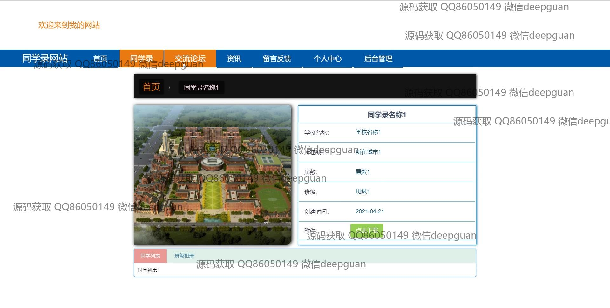
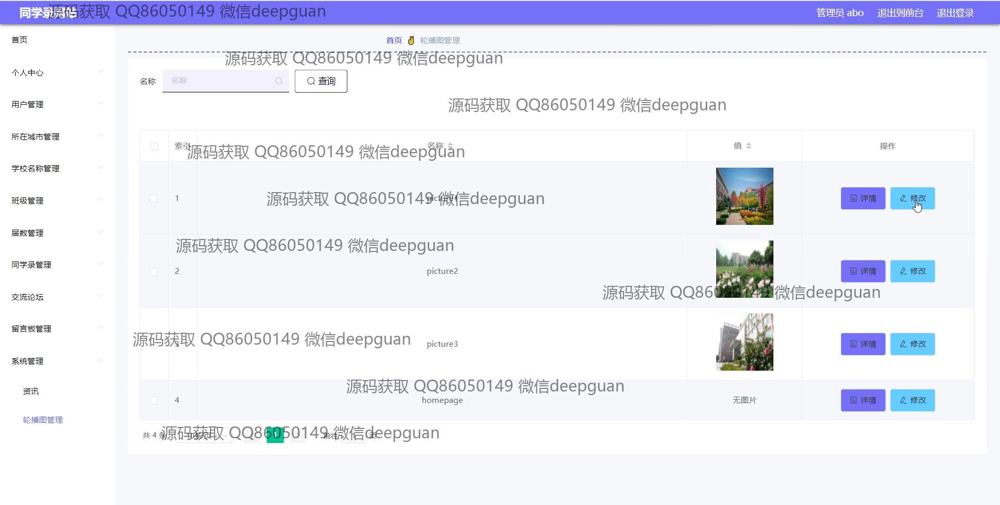

<h1 align="center">同学录网站+vue</h1>

## 简介
同学录网站：角色分为管理员、用户；提供用户注册与登录、个人信息管理、交流论坛、留言反馈、同学信息查询与管理、学校和城市管理等功能，界面简洁明晰，方便用户使用和管理。    --计算机毕业设计源码；毕设源码；java毕业设计源码

## 联系方式

<h3 align="center">获取完整代码与数据库文件 + 微信：deepguan QQ: 86050149 QQ群: 783742310</h3>

<h3 align="center">可帮忙远程部署 包运行成功！提供远程部署、修改代码、设计文档指导、代码讲解等服务！</h3>

## 功能介绍（完整见运行截图）
管理员： 基本功能包括登录、注册和退出，页面提供用户管理、城市和学校名称管理、班级管理和轮播图管理等。后台允许上传图片、设置创建时间，管理同学录信息、交流论坛帖子和留言反馈。顶栏包含返回前台和注销登录等选项。  
  
用户： 用户可在首页导航栏上浏览同学录、交流论坛、资讯等。个人中心允许编辑个人信息，如届数、班级、联系方式等。用户可以在交流论坛发布帖子，查看和修改自己的信息，并在留言反馈区提交意见。登录和注册界面提供输入框供账号及密码输入，并附注册用户和退出登录选项。

## 运行截图

本代码来源于网络,仅供学习参考使用!

